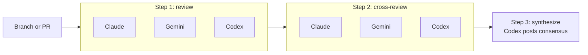

<div align="center">

# Netlify-Agent-eXecutor (`nax`)

**Run multi-step Netlify Agent workflows across Claude, Gemini, and Codex — declared in YAML, executed in order, waited on between rounds.**

[](https://nodejs.org/)
[](#license)
[](#install)

</div>

```bash
git clone https://github.com/netlify-labs/nax.git && cd nax && npm install && npm link
nax review          # multi-agent review of the current branch
```

---

## TL;DR

### The Problem

You want three AI models to review the same diff, then critique each other's reviews, then summarize the consensus. Doing this by hand means:

- Opening N issues per model with the same prompt
- Waiting for each agent run to finish before kicking off the next round
- Copy-pasting prior-round results into follow-up prompts
- Re-running the bottom half when one model times out

### The Solution

`nax` makes the orchestration the artifact. A workflow is `flows/<id>/flow.yml`. You run `nax`, pick a flow, pick where to run it, and the steps execute in order — fanning out to multiple agents per step, blocking until every agent finishes, and feeding prior-round output into the next step.

### Why Use `nax`?

| Feature | What it gets you |
|---|---|
| **Workflow-first** | Steps and prompts live in YAML + Markdown — diffable, reviewable, repeatable. |
| **Multi-agent fan-out per step** | Claude, Gemini, and Codex run the same prompt in parallel. |
| **Step gating** | Round N+1 only starts when every agent in round N has finished. |
| **Follow-up sessions** | A step can reuse a runner from a prior step so its agent sees its own context. |
| **Two transports, one CLI** | Run on GitHub Actions or directly via the Netlify Agent Runner API. |
| **Durable artifacts** | Every workflow, runner, and session lands under `.nax/` with `latest` symlinks. |
| **Resume** | A killed Netlify API run picks up at the first not-yet-completed step. |
| **Auto-injected review context** | Pinned SHA + open-PR ledger appended to every prompt unless you opt out. |
| **Hand-off in one flag** | `nax handoff -c` copies the latest consensus summary to your clipboard. |

---

## Quick Example

The bundled `review` flow runs three rounds against the current branch:

```bash
# Preview without creating anything
nax review --dry --force

# Run for real, choose transport interactively
nax review

# Specific branch / PR, non-interactively
nax review --branch fix/auth      --transport github-actions --force
nax review --branch '#123'        --transport netlify-api    --force

# Re-run just one step (or skip ahead)
nax review --step cross-review
nax review --from-step synthesize
```

What that produces:

1. **review** — Claude, Gemini, Codex each open a GitHub issue with the review prompt.
2. **cross-review** — each agent comments on the *other* agents' issues, via follow-up sessions on the same runner.
3. **synthesize** — Codex reads both rounds and posts one consensus issue.

The `do-next` flow asks each model to propose the next task and synthesizes one:

```bash
nax do-next
nax do-next --branch '#123' --transport netlify-api --force
```

---

## Design Philosophy

- **The YAML is the program.** Flows are not a DSL bolted onto code — they *are* the unit of execution. Anyone can read `flows/review/flow.yml` and tell you exactly what `nax review` will do.
- **Steps gate on results, not time.** A step's `waitFor: agent-results` makes the next step wait for every agent in the fan-out, not a wall-clock timeout. Long thinkers don't poison fast ones.
- **Same flow, two transports.** A flow runs identically on `github-actions` (workflow_dispatch into `netlify-labs/agent-runner-action`) and `netlify-api` (this machine orchestrates the runner directly). You don't rewrite the flow to move it.
- **Artifacts are first-class.** Every run, runner, and agent session writes a summary into `.nax/` with `latest` symlinks, so the next prompt or the next operator can pick up the trail.
- **Resume over re-run.** If your laptop sleeps mid-`netlify-api` run, `nax` finds the unfinished workflow on next launch and continues from the first incomplete step.

---

## Comparison

| | `nax` | Manual issue/comment loops | One-shot agent CLI | Custom orchestrator scripts |
|---|---|---|---|---|
| Multi-agent fan-out per step | ✅ | ⚠️ (manual N times) | ❌ | ⚠️ (you build it) |
| Waits for every agent before next step | ✅ | ⚠️ (you watch) | ❌ | ⚠️ |
| Follow-up sessions reuse runner context | ✅ | ❌ | ❌ | ⚠️ |
| GitHub Actions + Netlify API from one CLI | ✅ | ❌ | ❌ | ❌ |
| Durable per-step artifacts | ✅ | ❌ | ❌ | ⚠️ |
| Resume after process kill | ✅ (netlify-api) | ❌ | ❌ | ⚠️ |
| Auto-injected pinned SHA / PR ledger | ✅ | ❌ | ❌ | ❌ |

---

## Install

`nax` is currently **unpublished**. Install from source:

```bash
git clone https://github.com/netlify-labs/nax.git
cd nax
npm install
npm link    # exposes `nax` globally
```

**Prerequisites:**

- Node 18+
- [Netlify CLI](https://docs.netlify.com/cli/get-started/) — authenticated (`netlify login`)
- [GitHub CLI](https://cli.github.com/) — authenticated (`gh auth login`)

Verify:

```bash
nax --help
nax list
```

---

## Quick Start

1. **Authenticate the prereq CLIs** in any repo you want to run flows against:

   ```bash
   gh auth login
   netlify login
   ```

2. **Wire the repo for `nax`.** This links a Netlify site, writes the GitHub Actions workflow, and sets the repo secrets `NETLIFY_SITE_ID` + `NETLIFY_AUTH_TOKEN`:

   ```bash
   nax init
   ```

   Variations:

   ```bash
   nax init --no-github-actions        # only link a Netlify site, skip workflow + secrets
   nax init --create --site-name my-app # create a fresh Netlify site instead of linking
   nax init --dry                       # preview without writing
   ```

3. **Run a flow** (interactive picker if you omit the flow id):

   ```bash
   nax              # pick a flow
   nax review       # multi-agent review of current branch
   ```

4. **Hand off the result** to your IDE / the next session:

   ```bash
   nax handoff -c           # copy latest workflow summary to clipboard
   nax handoff --workflow <id> --flow review   # chain a follow-up flow
   ```

---

## Built-In Flows

| Flow | Use it for |
|---|---|
| `review` | Broad multi-agent code review with cross-review and consensus synthesis. |
| `ideas` | Multi-agent idea generation, adversarial scoring, reactions, and ranked synthesis. |
| `do-next` | Choosing the single most logical next development task. |
| `security-audit` | Auth, billing, webhook, tenant isolation, secrets, and attack-surface audits. |
| `performance-audit` | Bottleneck discovery and measurement-first optimization planning. |
| `analytics-audit` | Missing funnel, conversion, feature usage, and product telemetry plans. |
| `seo-audit` | Metadata, crawlability, structured data, links, alt text, content, page-speed checks. |
| `accessibility-audit` | WCAG 2.1 AA audit, synthesized fix plan, focused Codex implementation. |
| `mobile-responsiveness` | Small-viewport audit and focused responsive layout fixes. |
| `e2e-tests` | Critical-flow discovery, Playwright test planning, first test implementation. |
| `unit-tests` | High-value unit test gap discovery and focused test implementation. |
| `documentation` | README, setup, architecture, contributing docs grounded in the codebase. |
| `error-handling` | Error boundaries, logging, retries, validation, user-friendly failure states. |
| `ux-copy-polish` | Loading/empty/error states, visual polish, CTA hierarchy, product copy. |

Run `nax list` to print the live set.

---

## Commands

```text
nax [flow]                Pick a flow and run it (interactive if no flow given)
nax run [flow]            Alias for the above
nax init                  Wire this repo to Netlify + GitHub Actions
nax handoff               Copy or continue from prior workflow/session results
nax recent                Browse recent workflow/session/runner artifacts
nax retry [run-id]        Retry one failed Netlify API agent run, then continue
nax skills install        Install bundled agent skills into detected harness dirs
nax skills check          Show installed skill versions
nax skills update         Reinstall the latest bundled skill copy
nax list                  List available flows
```

### `nax run` flags

| Flag | What it does |
|---|---|
| `--dry` | Preview the workflow without creating issues/comments. |
| `--force` | Skip confirmation prompts. |
| `--branch <name>` | Branch to review. Accepts a PR selector like `#123`. |
| `--transport <kind>` | `auto` (default), `github-actions`, `netlify-api`. |
| `--step <id>` | Run only that step. |
| `--from-step <id>` | Run from that step through the end. |
| `--context <text>` | Extra context appended to every step's prompt. |
| `--context-file <path>` | Same, read from disk. |
| `--sha <rev>` | Pin auto-injected context to a specific git revision. |
| `--pr-limit <n>` | Cap open-PR ledger entries (default `10`). |
| `--timeout-minutes <n>` | Per-step wait (default `25`). |
| `--runner <mention>` | Agent runner mention prefix (default `@netlify`). |
| `--notify` | macOS desktop notification when the flow finishes. |
| `--no-auto-context` | Skip pinned SHA + PR ledger injection. |
| `--no-fetch-results` | Skip prior-round result fetching. |
| `--issue <list>` | Recovery: comma-separated issue numbers for comment steps. |
| `--from-issues <list>` | Recovery: source issue numbers to embed for comment steps. |

### `nax skills`

```bash
nax skills install                       # auto-detect .claude / .codex / .cursor / .gemini / .agents
nax skills install --provider codex      # explicit provider; repeatable
nax skills install --all-providers       # install into every supported provider
nax skills install --skill review        # install one named skill
nax skills install --all-skills          # install the full bundled matrix
nax skills check                         # compare installed versions vs. nax package version
nax skills update                        # reinstall latest
```

---

## Transports

| | `github-actions` | `netlify-api` |
|---|---|---|
| Where agents run | Netlify's hosted runner via a workflow in your repo | Netlify Agent Runner API, orchestrated by this machine |
| Requires | `.github/workflows/netlify-agents.yml` + repo secrets | Logged-in Netlify CLI with a linked site |
| Visibility | GitHub Actions logs + issues | Local console + issues |
| Desktop notifications | n/a | macOS only (`--notify`) |
| Resume after interruption | Re-run the issue | `nax` offers to resume the unfinished run |

`--transport auto` (default) prefers `github-actions` if both are configured. Pass `--transport netlify-api` to force Netlify API orchestration. `local-machine` remains as a backwards-compatible alias.

---

## How It Works



Each step waits for every agent before the next step starts. Round 2 reuses each runner via follow-up sessions so the cross-review sees its own prior context. Round 3 reads both rounds and posts one consensus issue.

### Repo layout

```text
bin/nax.js          # CLI entrypoint
lib/                # init, local-runner, flows, run-state, prompts, transports, ...
flows/<id>/         # workflow definitions and prompts
flows/<id>/flow.yml # one workflow file per built-in flow
flows/<id>/prompts/ # one Markdown prompt per step
templates/          # bundled GitHub Actions workflow template
test/               # node:test suites (`npm test`)
```

Key modules:

- `lib/transports.js:1` — transport resolution and dispatch.
- `lib/local-runner.js:1` — Netlify Agent Runner API orchestration.
- `lib/run-state.js:1` — `.nax/workflows/<id>/workflow.json` durable state.
- `lib/workflow-artifacts.js:1` — summary rollups.
- `lib/round-results.js:1` — prior-round result fetching for follow-up steps.

---

## Flow Anatomy

A flow is `flows/<id>/flow.yml` plus a `prompts/` directory beside it. Example (`flows/review/flow.yml`):

```yaml
id: review
title: Review
description: Review, cross-review, and synthesize findings.

defaults:
  transport: auto
  agents: [claude, gemini, codex]

steps:
  - id: review
    title: Review
    prompt: prompts/1_review.md
    action: issue         # `issue` opens a new issue, `comment` replies on an existing one
    submit: new-run       # `new-run` spawns a fresh runner, `follow-up` reuses the runner from `input`
    agents: [claude, gemini, codex]
    waitFor: agent-results

  - id: cross-review
    title: Cross Review
    prompt: prompts/2_cross-review.md
    action: comment
    submit: follow-up
    agents: [claude, gemini, codex]
    input:
      - step: review
        results: all
    waitFor: agent-results

  - id: synthesize
    title: Summarize Consensus
    prompt: prompts/3_summarize-consensus.md
    action: issue
    submit: new-run
    agents: [codex]
    input:
      - step: review
        results: all
      - step: cross-review
        results: all
    waitFor: agent-results
```

Prompt files are plain Markdown. The runner appends auto-injected review context (pinned SHA, open-PR ledger) and prior-round results before submission unless you pass `--no-auto-context` / `--no-fetch-results`.

### Step keys

| Key | Values | What it does |
|---|---|---|
| `action` | `issue`, `comment` | Open a new issue per agent, or comment on the source issue. |
| `submit` | `new-run`, `follow-up` | Spawn a fresh runner, or reuse the runner from a prior step. |
| `agents` | list of `claude`, `gemini`, `codex` | Fan-out targets for this step. |
| `input` | `[{ step, results }]` | Prior step(s) whose results are passed into this prompt. |
| `waitFor` | `agent-results` | Block on every agent completing before the next step. |

---

## Artifacts And Handoff

Every completed workflow writes durable artifacts under `.nax/`:

```text
.nax/workflows/<workflow-run-id>/workflow.json
.nax/workflows/<workflow-run-id>/artifacts/summary.md
.nax/agent-runners/<runner-id>/summary.md
.nax/agent-sessions/<session-id>/summary.md
```

- `.nax/workflows/` — full multi-step workflow record and rollup.
- `.nax/agent-runners/` — one Netlify Agent Runner thread/conversation rollup.
- `.nax/agent-sessions/` — one concrete agent result with output, usage, links, metadata.

Each directory has a `latest` symlink (when the filesystem supports symlinks). The most common handoff file is:

```text
.nax/workflows/latest/artifacts/summary.md
```

### Handing off

```bash
nax handoff                          # interactive picker (latest/workflow/session/runner)
nax handoff -c                       # copy latest summary to clipboard
nax handoff --session <id> -c
nax handoff --runner  <id> --agent codex
nax handoff --workflow <id> --flow review     # chain a follow-up flow
```

### Browsing recents

```bash
nax recent                                   # interactive list of recent artifacts
nax recent --type workflow --limit 10
nax recent --run-id <id>                     # jump straight to one
```

---

## Resume And Retry

If a `netlify-api` run is interrupted (process killed, machine slept, network died) the workflow state is in `.nax/workflows/<workflow-run-id>/workflow.json`. Next time you start `nax`, it detects the unfinished workflow and offers to resume — it polls the in-flight runner sessions and continues from the first not-yet-completed step.

Failed and timed-out runs are terminal; resume only polls in-flight runs. To retry a failed step:

```bash
nax retry                            # interactive picker
nax retry <run-id> --step cross-review --agent gemini
nax run review --step <step-id>      # re-run one step from scratch
```

---

## Troubleshooting

| Error | Fix |
|---|---|
| `gh: command not found` or `netlify: command not found` | Install and authenticate both CLIs (`gh auth login`, `netlify login`). |
| `Could not resolve NETLIFY_SITE_ID` | `nax init` couldn't find a linked site. Run `netlify link` or pass `--site-id` / `--site-name` / `--create`. |
| `Branch has uncommitted changes` | `nax` warns before submitting. Commit/stash, or accept the warning if you want agents to review WIP. |
| Agent run times out | Bump `--timeout-minutes`. Default `25`; long-running flows often want `45+`. |
| `Pinned SHA not on remote` | Auto-injected context pins to a SHA. Push first, or pass `--no-auto-context`. |
| Resume keeps offering an old run | Decline the prompt; the run state is moved out of "unfinished" once you do. |

---

## Limitations

- **Unpublished.** Install via clone + `npm link`. No `npm i -g` yet.
- **Authenticated CLIs only.** Requires logged-in `netlify` and `gh`. No web auth flow.
- **macOS-only desktop notifications.** `--notify` shells out to `osascript`.
- **GitHub-only.** No GitLab/Bitbucket transport.
- **`netlify-api` transport assumes outbound network.** Your machine must reach Netlify's API.
- **Three agents.** Claude, Gemini, Codex. Adding more requires extending the runner action and the flow schema.
- **No partial-failure auto-rollback.** If one agent fails mid-step, the workflow surfaces the failure; you decide whether to `nax retry` or `--from-step`.

---

## FAQ

**Q: Why not just use Claude Code (or another single-CLI agent) and call it a day?**
A: Single-CLI agents can't cheaply give you three independent perspectives on the same diff, then have them critique each other. `nax` is the gluing layer that turns "ask one model" into "run a fan-out + synthesis workflow." If you only ever want one model, you don't need `nax`.

**Q: Does `nax` upload my code anywhere?**
A: `nax` itself is a local CLI. The agents run on Netlify Agent Runner (either via your repo's GitHub Actions or via the Netlify Agent Runner API). What ends up on Netlify is whatever the runner action sends — typically the repo checkout and your prompt.

**Q: Can I write a custom flow?**
A: Yes — `flows/<id>/flow.yml` plus a `prompts/` dir is the whole contract. Drop a new flow in the repo and `nax list` will pick it up.

**Q: Can I run only one agent for a step?**
A: Set the step's `agents:` list to one entry (e.g. `agents: [codex]`). The `synthesize` step in the bundled flows does this.

**Q: What happens if one agent fails mid-step?**
A: The step still completes when the other agents finish or time out. The failed agent's result is recorded as a failure; downstream steps that depend on it can still run with the surviving results. Use `nax retry` to redo just the failed one.

**Q: Why YAML instead of code?**
A: YAML is diffable, reviewable, and trivially generatable. A workflow as a text file means a human can read the README, open `flows/review/flow.yml`, and have a full mental model in 30 seconds.

**Q: Can I run this without GitHub Actions?**
A: Yes — pass `--transport netlify-api` (or skip the workflow file in `nax init --no-github-actions`). The trade-off is that your machine has to stay alive for the duration of the run (or you'll hit the resume path).

---

## License

MIT
