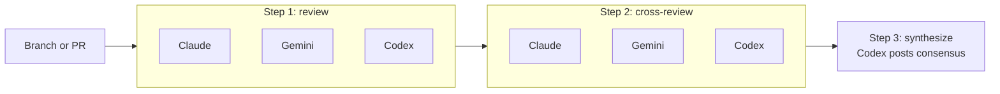

# netlify-agent-executor

`nax` runs multi-step Netlify Agent Runner workflows across multiple AI models (Claude, Gemini, Codex) and waits for results between steps so each step sees the previous round's output.

It is workflow-first: flows live in `flows/<id>/flow.yml`, declare their steps and prompts, and run identically on GitHub Actions or directly on your machine via the Netlify CLI.

## The Problem

You want three AI models to review the same diff, then critique each other's reviews, then summarize the consensus. Doing this by hand means:

- Opening N issues per model with the same prompt
- Waiting for each agent run to finish before kicking off the next round
- Copy-pasting prior-round results into follow-up prompts
- Re-running the bottom half when one model times out

`nax` does all of that for you. A workflow is a YAML file. You run `nax`, pick a flow, pick where to run it, and watch the steps execute in order.

## How It Works



Each step waits for every agent to finish before the next step starts. Round 2 reuses each runner via follow-up sessions so the cross-review sees its own prior context. Round 3 reads both rounds and posts one consensus issue.

## Quick Example

The built-in `review` flow runs three steps against the current branch:

```bash
# Preview without creating anything
nax review --dry --force

# Run for real, choose transport interactively
nax review

# Run a specific branch or PR, non-interactively
nax review --branch fix/auth --where github-actions --force
nax review --branch '#123' --where local-machine --force

# Re-run just one step
nax review --step cross-review
nax review --from-step synthesize
```

Step output for `review`:

1. **review** — each agent opens its own GitHub issue with the review prompt.
2. **cross-review** — each agent comments on the *other* agents' issues, follow-up sessions on the same runner.
3. **synthesize** — `codex` reads both rounds and posts a consensus issue.

The built-in `do-next` flow asks each model to recommend the next development task, then asks Codex to synthesize the recommendations into one concrete next task:

```bash
nax do-next
nax do-next --branch '#123' --where local-machine --force
```

## Install

This is an unpublished package. Clone and link:

```bash
git clone https://github.com/netlify-labs/nax.git
cd nax
npm install
npm link    # exposes `nax` globally
```

Requires Node 18+, the [Netlify CLI](https://docs.netlify.com/cli/get-started/), and the [GitHub CLI](https://cli.github.com/). Both must be authenticated:

```bash
netlify login
gh auth login
```

## Setup

`nax init` wires a repository to either transport:

```bash
# Link a Netlify site to this repo, write the GitHub Actions workflow,
# and set NETLIFY_SITE_ID + NETLIFY_AUTH_TOKEN secrets.
nax init

# Same but skip the workflow file and secrets (only set up the Netlify link)
nax init --no-github-actions

# Create a fresh Netlify site instead of linking to an existing one
nax init --create --site-name my-app

# Preview without writing anything
nax init --dry
```

What it does:

- Runs `netlify init` if no site is linked (or `netlify link --id/--name` if you pass `--site-id`/`--site-name`).
- Writes `.github/workflows/netlify-agents.yml` using `netlify-labs/agent-runner-action`.
- Sets `NETLIFY_SITE_ID` and `NETLIFY_AUTH_TOKEN` GitHub repo secrets via `gh secret set`. The auth token is read from your local Netlify CLI config; if missing, run `netlify login` first or set `NETLIFY_AUTH_TOKEN`.

## Transports

| | `github-actions` | `local-machine` |
|---|---|---|
| Where agents run | Netlify's hosted runner via a workflow in your repo | Your laptop, via `netlify api createAgentRunner` |
| Requires | `.github/workflows/netlify-agents.yml` + repo secrets | Logged-in Netlify CLI with a linked site |
| Visibility | GitHub Actions logs + issues | Local console + issues |
| Desktop notifications | n/a | macOS only (`--notify`) |
| Resume after interruption | Re-run the issue | `nax` offers to resume the unfinished local run |

`--where auto` (default) prefers `github-actions` if both are configured. Pass `--where local-machine` to force local.

## Commands

```text
nax [flow]                Pick a flow and run it (interactive if no flow given)
nax run [flow]            Alias for the above
nax init                  Wire this repo to Netlify + GitHub Actions
nax skills install        Install bundled agent skills into detected harness dirs
nax skills check          Show installed skill versions
nax list                  List available flows
```

Notable `run` flags:

- `--dry` / `--force` — preview / skip prompts. Combine for non-destructive non-interactive runs.
- `--branch <name>` — pick the branch to review. Accepts a PR selector like `#123`.
- `--step <id>` / `--from-step <id>` — run a single step or skip ahead.
- `--context <text>` / `--context-file <path>` — extra context appended to every step's prompt.
- `--sha <rev>` — pin the auto-injected context to a specific git revision.
- `--timeout-minutes <count>` — how long to wait per step (default `25`).
- `--runner <mention>` — agent mention prefix (default `@netlify`).
- `--no-auto-context` / `--no-fetch-results` — opt out of the automatic review contract / prior-round fetching.

Skill commands:

- `nax skills install` — installs bundled skills into detected provider directories like `.claude`, `.codex`, `.cursor`, `.gemini`, or `.agents`. If none exist, it installs into `.claude/skills`.
- `nax skills update` — reinstalls the latest bundled copy.
- `nax skills check` — compares installed skill versions with the current `nax` package version.
- `--provider <name>` — choose a provider explicitly; repeatable, accepts `codex` or `.codex`.
- `--all-providers` / `--all-skills` — install or check the full supported matrix.

## Flow Anatomy

A flow is `flows/<id>/flow.yml` plus a `prompts/` directory beside it:

```yaml
id: review
title: Review
description: Review, cross-review, and synthesize findings.

defaults:
  transport: auto
  agents: [claude, gemini, codex]

steps:
  - id: review
    title: Review
    prompt: prompts/review.md
    action: issue         # `issue` opens a new issue, `comment` replies on an existing one
    submit: new-run       # `new-run` spawns a fresh runner, `follow-up` reuses the runner from `input`
    agents: [claude, gemini, codex]
    waitFor: agent-results

  - id: cross-review
    title: Cross Review
    prompt: prompts/cross-review.md
    action: comment
    submit: follow-up
    agents: [claude, gemini, codex]
    input:
      - step: review
        results: all
    waitFor: agent-results
```

Prompt files are plain Markdown. The runner appends auto-injected review context (pinned SHA, PR ledger) and prior-round results before submission unless you opt out with `--no-auto-context` / `--no-fetch-results`.

## Resume

If a local run is interrupted (process killed, machine slept, network died) the run state is written to `.nax/runs/<run-id>/run.json`. Next time you start `nax`, it detects the unfinished run and offers to resume — it polls the in-flight runner sessions and continues from the first not-yet-completed step.

Failed and timed-out runs are terminal; resume polls in-flight runs only. To retry a failed step, re-run the flow with `--step <id>`.

## Troubleshooting

**`gh: command not found` or `netlify: command not found`** — both CLIs are required. Install and authenticate them (`gh auth login`, `netlify login`).

**`Could not resolve NETLIFY_SITE_ID`** — `nax init` couldn't find a linked site. Run `netlify link` (or pass `--site-id`/`--site-name`/`--create`).

**`Branch has uncommitted changes`** — `nax` warns before submitting. Commit/stash, or accept the warning if you want the agents to review WIP.

**Agent run times out** — bump `--timeout-minutes`. Default is 25; long-running flows may want 45+.

**`Pinned SHA not on remote`** — the auto-injected context pins to a SHA. If you just committed and haven't pushed, push first, or pass `--no-auto-context`.

**Resume keeps offering an old run** — decline the prompt; the run state is moved out of "unfinished" once you do.

## Limitations

- Requires authenticated `netlify` and `gh` CLIs. No web auth flow.
- Desktop notifications (`--notify`) only work on macOS (`osascript`).
- Not published to npm; install via clone + `npm link`.
- GitHub-only — no GitLab/Bitbucket transport.
- Local transport assumes you can reach Netlify's API from your machine.

## Repo Layout

```text
bin/nax.js          # CLI entrypoint
lib/                # init, local-runner, flows, run-state, prompts, ...
flows/<id>/         # workflow definitions and prompts
templates/          # bundled GitHub Actions workflow template
test/               # node:test suites (`npm test`)
```

## License

MIT
