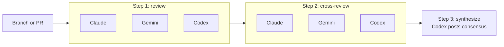

<div align="center">

# Netlify-Agent-eXecutor (`nax`)

**Run multi-step Netlify Agent workflows across Claude, Gemini, and Codex from your Netlify project.**

</div>

## Quickstart

`nax` uses the [netlify-cli](https://cli.netlify.com/) and [GitHub CLI](https://cli.github.com/). Make sure you have those on your machine for `nax` to operate.

```bash
npm install -g @davidwells/netlify-agent-executor
# Connect to your Netlify project or create and connect a new site
nax init
# Start using Netlify agentic workflows
nax
```

---

## TL;DR

### The Problem

You want the best possible coding outcome from the world's leading agentic coding models, not just whichever one you happen to subscribe to. Claude Code, Gemini, and Codex each catch different classes of issues; the real value shows up when they review the same work, cross-check each other's findings, and synthesize one consensus. Doing that manually means:

- Opening N issues per model with the same prompt
- Waiting for each agent run to finish before kicking off the next round
- Copy-pasting prior-round results into follow-up prompts
- Re-running the bottom half when one model times out

### The Solution

`nax` makes the orchestration the artifact. A workflow is a `flow.*` config file plus Markdown prompts. Use YAML if you like it, or write the flow in JSON, JavaScript, TypeScript, or TOML instead. You run `nax`, pick a flow, pick where to run it, and the steps execute in order — fanning out to multiple agents per step, blocking until every agent finishes, and feeding prior-round output into the next step.

### Why Use `nax`?

| Feature | What it gets you |
|---|---|
| **Workflow-first** | Steps and prompts live in config files + Markdown — diffable, reviewable, repeatable. |
| **Multi-agent fan-out per step** | Claude, Gemini, and Codex run the same prompt in parallel. |
| **Step gating** | Round N+1 only starts when every agent in round N has finished. |
| **Follow-up sessions** | A step can reuse a runner from a prior step so its agent sees its own context. |
| **Two transports, one CLI** | Run on GitHub Actions or directly via the Netlify Agent Runner API. |
| **Single-agent runs** | Start Claude, Gemini, or Codex directly without creating a full workflow. |
| **Project-aware Netlify selection** | Multi-project repos prompt for the Netlify project/config to run against. |
| **Durable artifacts** | Every workflow, runner, and session lands under `.nax/` with `latest` symlinks. |
| **Resume** | A killed Netlify API run picks up at the first not-yet-completed step. |
| **Agent-only CI hooks** | `nax ci '<command>'` runs commands inside Netlify Agent Runner and no-ops elsewhere. |
| **Auto-injected review context** | Pinned SHA + open-PR ledger appended to every prompt unless you opt out. |
| **Hand-off in one flag** | `nax handoff -c` copies the latest consensus summary to your clipboard. |

---

## Quick Example

The bundled `review` flow runs three rounds against the current branch:

```bash
# Preview without creating issues, runners, or .nax files
nax review --dry --force

# Run for real, choose transport interactively
nax review

# Run one agent without a workflow
nax --agent gemini --prompt "Check this branch for broken links"

# Specific branch / PR, non-interactively
nax review --branch fix/auth      --transport github-actions --force
nax review --branch '#123'        --transport netlify-api    --force

# Re-run just one step (or skip ahead)
nax review --step cross-review
nax review --from-step synthesize
```

The `review` workflow looks like this:

```bash
╭────────────────────────────────────────────────────────────────────────────╮
│  Multi step agent workflow: "Review"                                       │
├────────────────────────────────────────────────────────────────────────────┤
│  Review, cross-review, and synthesize findings with multiple Netlify       │
│  agents.                                                                   │
│                                                                            │
│  Orchestrated via: Netlify API                                             │
│  Branch: master                                                            │
│                                                                            │
│  ╭──────────────────────────────────────────────────────────────────────╮  │
│  │  1. Review                                            new agent run  │  │
│  ├──────────────────────────────────────────────────────────────────────┤  │
│  │  Explore, review, and improve the current setup with three           │  │
│  │  independent agents.                                                 │  │
│  │  ╭────────╮ ╭────────╮ ╭───────╮                                     │  │
│  │  │ Claude │ │ Gemini │ │ Codex │                                     │  │
│  │  ╰────────╯ ╰────────╯ ╰───────╯                                     │  │
│  ╰──────────────────────────────────────────────────────────────────────╯  │
│                                    │                                       │
│                                    ▼                                       │
│  ╭──────────────────────────────────────────────────────────────────────╮  │
│  │  2. Cross Review                                  follow-up session  │  │
│  ├──────────────────────────────────────────────────────────────────────┤  │
│  │  Cross-check the first-round Claude/Gemini/Codex review findings     │  │
│  │  against each other.                                                 │  │
│  │  ╭────────╮ ╭────────╮ ╭───────╮                                     │  │
│  │  │ Claude │ │ Gemini │ │ Codex │                                     │  │
│  │  ╰────────╯ ╰────────╯ ╰───────╯                                     │  │
│  ╰──────────────────────────────────────────────────────────────────────╯  │
│                                    │                                       │
│                                    ▼                                       │
│  ╭──────────────────────────────────────────────────────────────────────╮  │
│  │  3. Summarize Consensus                               new agent run  │  │
│  ├──────────────────────────────────────────────────────────────────────┤  │
│  │  Summarize the first-round reviews and second-round cross-review     │  │
│  │  outputs into one ranked consensus plan.                             │  │
│  │  ╭───────╮                                                           │  │
│  │  │ Codex │                                                           │  │
│  │  ╰───────╯                                                           │  │
│  ╰──────────────────────────────────────────────────────────────────────╯  │
╰────────────────────────────────────────────────────────────────────────────╯
```

What that produces:

1. **review** — Claude, Gemini, Codex each open a GitHub issue with the review prompt.
2. **cross-review** — each agent comments on the *other* agents' issues, via follow-up sessions on the same runner.
3. **synthesize** — Codex reads both rounds and posts one consensus issue.

After the `review` is complete, you can use the `nax handoff` command to pass the results on to downstream AI tooling.

```bash
nax handoff
╭───────────────────────────────────────────────────────────────────────────────────────────╮
│  Latest result from Claude agent runner                                                   │
├───────────────────────────────────────────────────────────────────────────────────────────┤
│  Date:    May 20, 2026, 7:39 PM (14 days ago)                                             │
│  Summary: .nax/agent-runners/6a0e6eedd90fa5ba6cbb2f6a/summary.md                          │
│  Preview:                                                                                 │
│  - Agent: Claude                                                                          │
╰───────────────────────────────────────────────────────────────────────────────────────────╯

│
◆  Hand off previous results
│  ● Copy latest results markdown to clipboard (from claude .nax/agent-runners/6a0e6eedd90fa5ba6cbb2f6a/summary.md)
│  ○ Copy latest results filePath to clipboard (.nax/agent-runners/6a0e6eedd90fa5ba6cbb2f6a/summary.md)
│  ○ Open latest results in code editor (.nax/agent-runners/6a0e6eedd90fa5ba6cbb2f6a/summary.md)
│  ○ Run followup prompt with previous results (claude .nax/agent-runners/6a0e6eedd90fa5ba6cbb2f6a/summary.md)

Copied .nax/agent-runners/6a0e6eedd90fa5ba6cbb2f6a/summary.md to clipboard
```

This is handy for passing remote Netlify agent runner results into local Claude Code or Codex sessions to continue work on your machine.

---

## Design Philosophy

- **The flow file is the program.** Flows are not a DSL bolted onto code — they *are* the unit of execution. Anyone can read a workflow's `flow.yml` (or `flow.json`, `flow.js`, `flow.ts`, `flow.toml`) and tell you exactly what `nax review` will do.
- **Steps gate on results, not time.** A step's `waitFor: agent-results` makes the next step wait for every agent in the fan-out, not a wall-clock timeout. Long thinkers don't poison fast ones.
- **Same flow, two transports.** A flow runs identically on `github-actions` (workflow_dispatch into `netlify-labs/agent-runner-action`) and `netlify-api` (this machine orchestrates the runner directly). You don't rewrite the flow to move it.
- **Artifacts are first-class.** Every run, runner, and agent session writes a summary into `.nax/` with `latest` symlinks, so the next prompt or the next operator can pick up the trail.
- **Resume over re-run.** If your laptop sleeps mid-`netlify-api` run, `nax` finds the unfinished workflow on next launch and continues from the first incomplete step.

---

## Comparison

| | `nax` | Manual issue/comment loops | One-shot agent CLI | Custom orchestrator scripts |
|---|---|---|---|---|
| Multi-agent fan-out per step | ✅ | ⚠️ (manual N times) | ❌ | ⚠️ (you build it) |
| Waits for every agent before next step | ✅ | ⚠️ (you watch) | ❌ | ⚠️ |
| Follow-up sessions reuse runner context | ✅ | ❌ | ❌ | ⚠️ |
| GitHub Actions + Netlify API from one CLI | ✅ | ❌ | ❌ | ❌ |
| Durable per-step artifacts | ✅ | ❌ | ❌ | ⚠️ |
| Resume after process kill | ✅ (netlify-api) | ❌ | ❌ | ⚠️ |
| Auto-injected pinned SHA / PR ledger | ✅ | ❌ | ❌ | ❌ |

---

## Install

From npm:

```bash
npm install -g @davidwells/netlify-agent-executor
```

Without installing globally:

```bash
npx @davidwells/netlify-agent-executor review
npx @davidwells/netlify-agent-executor --agent codex --prompt "Review this change"
npx @davidwells/netlify-agent-executor ci 'npm test'
```

Or from source:

```bash
git clone https://github.com/netlify-labs/nax.git
cd nax
npm install
npm link    # exposes `nax` globally
```

**Prerequisites:**

- Node 18+ for the published CLI. Developing or rebuilding the dashboard UI requires Node 20.19+ or 22.12+.
- [Netlify CLI](https://docs.netlify.com/cli/get-started/) — authenticated (`netlify login`)
- [GitHub CLI](https://cli.github.com/) — authenticated (`gh auth login`)

Verify:

```bash
nax --help
nax list
```

---

## Quick Start

1. **Authenticate the prereq CLIs** in any repo you want to run flows against:

   ```bash
   gh auth login
   netlify login
   ```

2. **Wire the repo for `nax`.** This links a Netlify site, writes the GitHub Actions workflow, and sets the repo secrets `NETLIFY_SITE_ID` + `NETLIFY_AUTH_TOKEN`:

   ```bash
   nax init
   ```

   Variations:

   ```bash
   nax init --no-github-actions        # only link a Netlify site, skip workflow + secrets
   nax init --create --site-name my-app # create a fresh Netlify site instead of linking
   nax init --dry                       # preview without writing
   ```

3. **Run a flow** (interactive picker if you omit the flow id):

   ```bash
   nax              # pick single-agent run or workflow
   nax review       # multi-agent review of current branch
   nax --agent codex --prompt "Check the nav links"
   ```

   The interactive picker separates built-in NAX workflows from project-local workflows:

   ```text
   ◆  What do you want to run?
   │  ● Start a single Netlify agent with a custom prompt
   │  ○ NAX Workflow - Review (Review, cross-review, synthesize)
   │  ○ NAX Workflow - Performance Audit (Find bottlenecks and measurement gaps)
   │  ○ Workflow - Local Smoke Test (Minimal project-local workflow for verifying nax...)
   ```

4. **Run from anywhere in the repo.** `nax` resolves the Git root before transport and Netlify project detection, so subdirectories work:

   ```bash
   cd frontend
   nax --agent gemini --prompt "Check for broken links"
   ```

5. **Hand off the result** to your IDE / the next session:

   ```bash
   nax handoff -c           # copy latest workflow summary to clipboard
   nax handoff --workflow <id> --flow review   # chain a follow-up flow
   ```

---

## Built-In Flows

| Flow | Use it for |
|---|---|
| `review` | Broad multi-agent code review with cross-review and consensus synthesis. |
| `human-review-example` | Example flow that pauses for human approval before continuing. |
| `ideas` | Multi-agent idea generation, adversarial scoring, reactions, and ranked synthesis. |
| `do-next` | Choosing the single most logical next development task. |
| `security-audit` | Auth, billing, webhook, tenant isolation, secrets, and attack-surface audits. |
| `performance-audit` | Bottleneck discovery and measurement-first optimization planning. |
| `analytics-audit` | Missing funnel, conversion, feature usage, and product telemetry plans. |
| `seo-audit` | Metadata, crawlability, structured data, links, alt text, content, page-speed checks. |
| `accessibility-audit` | WCAG 2.1 AA audit, synthesized fix plan, focused Codex implementation. |
| `mobile-responsiveness` | Small-viewport audit and focused responsive layout fixes. |
| `e2e-tests` | Critical-flow discovery, Playwright test planning, first test implementation. |
| `unit-tests` | High-value unit test gap discovery and focused test implementation. |
| `documentation` | README, setup, architecture, contributing docs grounded in the codebase. |
| `error-handling` | Error boundaries, logging, retries, validation, user-friendly failure states. |
| `ux-copy-polish` | Loading/empty/error states, visual polish, CTA hierarchy, product copy. |

Run `nax list` to print the live set.

---

## Commands

```text
nax [flow]                Pick a flow and run it (interactive if no flow given)
nax run [flow]            Alias for the above
nax --agent <name>        Run one Netlify agent with a custom prompt
nax run --agent <name>    Same single-agent path, explicit subcommand form
nax init                  Wire this repo to Netlify + GitHub Actions
nax handoff               Copy or continue from prior workflow/session results
nax recent                Browse recent workflow/session/runner artifacts
nax retry [run-id]        Retry one failed Netlify API agent run, then continue
nax sync last             Pull remote updates for the latest local Agent Runner
nax clean blobs           Preview or delete stale prompt blob refs
nax dashboard [flow]      Open the local workflow dashboard
nax ci '<command>'        Run a command only inside Netlify Agent Runner
nax skills install        Install bundled agent skills into detected harness dirs
nax skills check          Show installed skill versions
nax skills update         Reinstall the latest bundled skill copy
nax list                  List available flows
```

### `nax dashboard`

```bash
nax dashboard review
nax dashboard --no-open
nax dashboard --no-open --tail
nax dashboard --project-root ../my-site --flows-dir .github/nax-flows
```

`nax dashboard` starts a localhost workbench for browsing workflows and renders the selected flow as a React Flow graph. Browsing and graph rendering are read-only. Dry-run and run controls are explicit actions inside the workbench.

The workbench includes:

| Surface | Behavior |
|---|---|
| Workflow list | Reads the same project and bundled flow definitions as `nax list`. |
| Graph canvas | Renders workflow steps as React Flow nodes with agents, inputs, submit mode, and run status. |
| Dry Run | Calls the local API to run `nax run <flow> --dry --force`; it previews the command and output without writing `.nax` artifacts. |
| Run | Requires a browser confirmation, then starts the workflow through the local `nax` command and streams stdout/stderr plus structured run events into the UI. |
| Recent runs | Reads durable `.nax/workflows` state, highlights resumable runs, and overlays run status on the graph. |
| Run details actions | Opens saved workflow, step, and agent results; switches between Results and Prompt when prompt markdown is available; copies or opens the active markdown source; and can send selected artifacts to a follow-up agent. |

The browser talks only to the local dashboard server. Mutating endpoints require a per-process token embedded in the opened URL, and the server binds to `127.0.0.1` by default. Real runs still use the same transport setup as the CLI, so GitHub Actions and Netlify API prerequisites are unchanged.

Run details resolve the original step prompt from the workflow definition when possible. The center pane switches between rendered **Results** and **Prompt**, while the table of contents, copy button, open-file actions, and markdown source links follow the active view.

From a completed run details modal, **Send to next agent** opens a follow-up composer. The composer requires fresh user instructions before submission, defaults to the last meaningful result artifact, and lets you choose which workflow, step, runner, session, or result artifacts to include. In **Follow up prompt on previous Agent Run** mode, the selected model continues the matching prior Netlify Agent Runner when one exists; extra selected models start fresh runner threads seeded with the selected artifacts. **Start fresh agent runner** always starts new runner threads.

Dashboard follow-up submission returns after Netlify accepts the runner/session, not after the remote agent finishes. The notification includes remote links and any local artifact path the server could persist. Fresh runner submissions are saved as one-step pseudo-workflow runs so they can be opened from Recent runs. If Netlify accepts work but local artifact persistence fails, the API still returns success with `warnings[]` so the remote link is not lost.

Live graph status is event-driven. When the dashboard starts a real run, the child `nax run` process writes JSONL lifecycle events on file descriptor 3 while stdout/stderr are captured for the UI. The dashboard server relays those structured events to the browser with Server-Sent Events at `/api/runs/<id>/events`, and the UI reducer updates step cards, model pills, edges, output, and diagnostics from those events. Pass `--tail` to also stream the child workflow stdout/stderr back to the `nax dashboard` terminal while debugging.

Each durable run also stores the same structured stream at:

```text
.nax/workflows/<run-id>/events.jsonl
```

Browser reconnects replay from that log with `since=<seq>`, and developers can inspect the raw stream as JSON at:

```text
/api/runs/<run-id>/events.json?since=<seq>
```

The Output panel diagnostics button shows the latest raw events and parser errors. Remote model status is best effort: `nax` emits every Netlify API or GitHub Actions transition it can prove, but it may show `submitted` or `waiting` when the remote service does not expose a more precise live state yet. Cancellation stops local orchestration and marks submitted remote work as abandoned; cancelling remote Agent Runner jobs is a separate transport feature.

The published command serves built UI assets from the package. Developing or rebuilding the UI uses Vite 8, which requires Node 20.19+ or 22.12+:

```bash
npm run dashboard:dev
npm run dashboard:build
npm run dashboard:smoke
```

By default, `npm run dashboard:dev` serves read-only workflow data from Vite so the UI can boot without a running backend. To iterate against the real local API runner, start the dashboard server in one terminal:

```bash
node bin/nax.js dashboard --no-open --port 53734
```

For terminal-side debugging of runs started from the browser:

```bash
node bin/nax.js dashboard --no-open --tail --port 53734
```

Copy the `token` value from the printed URL, then start Vite in another terminal:

```bash
NAX_DASHBOARD_API_URL=http://127.0.0.1:53734 npm run dashboard:dev
```

Open the Vite URL with the same token:

```text
http://127.0.0.1:5173/?token=<token>&workflow=do-next
```

You can also inject the token from the proxy process and omit it from the Vite URL:

```bash
NAX_DASHBOARD_API_URL=http://127.0.0.1:53734 NAX_DASHBOARD_TOKEN=<token> npm run dashboard:dev
```

`NAX_DASHBOARD_API_URL` may point at either the backend origin or its `/api` path. For the common fixed-port loop, `npm run dashboard:dev:real` defaults the backend to `http://127.0.0.1:53734`.

### `nax ci`

```bash
nax ci 'npm test && npm run build'
```

`nax ci` no-ops outside Netlify Agent Runner environments, including normal local shells and Netlify build CI. Inside Agent Runner it executes the command through the shell and exits with the command's status.

This is useful in prompts when you want an agent to run project checks only in the runner environment:

```bash
nax ci 'npm run typecheck'
nax ci 'npm test -- --runInBand'
```

### Single-agent runs

```bash
nax --agent codex --prompt "Review this branch for regressions"
nax run --agent gemini --prompt "Check for broken links"
nax --agent claude --transport netlify-api
```

If you omit `--prompt` in a TTY, `nax` opens a multiline prompt. Single-agent runs still use the same transport detection, Netlify project picker, artifacts, and handoff support as workflows.

### `nax sync`

```bash
nax sync last
nax sync https://github.com/OWNER/REPO/actions/runs/123456789
nax sync 123456789 --repo OWNER/REPO
```

`nax sync last` reconciles the latest local `.nax/agent-runners/<id>` artifact with remote Netlify Agent Runner sessions. Use it when a follow-up happened out of band in the Netlify UI or another process and the local `.nax` cache is missing the newer session.

The command fetches remote sessions with the Netlify CLI, writes missing or changed sessions under `.nax/agent-sessions/`, and rebuilds the runner rollup under `.nax/agent-runners/`.

When the target is a GitHub Actions run URL or run ID, `nax sync` downloads the uploaded `nax-<flow>-<run_id>` artifact with `gh`, merges its workflow, runner, and session artifacts into local `.nax/`, localizes the workflow metadata for this checkout, and rebuilds the `latest` symlinks. This is the handoff path for workflows run through `.github/workflows/run-nax.yml`.

### `nax clean`

```bash
nax clean blobs
nax clean blobs --ttl-hours 1 --force
```

`nax clean blobs` sweeps stale or pending Netlify Blob prompt refs recorded in `.nax/blob-refs.jsonl`. It is a dry run by default. Add `--force` to delete eligible remote refs after interrupted runs or cleanup retries. Local debug mirrors under `.nax/workflows/<run-id>/blobs/` are workflow artifacts and are not removed by this command.

### `nax run` flags

| Flag | What it does |
|---|---|
| `--dry` | Preview the workflow plan without creating issues, comments, Agent Runner jobs, or `.nax` artifacts. |
| `--force` | Skip confirmation prompts. |
| `--branch <name>` | Branch to review. Accepts a PR selector like `#123`. |
| `--transport <kind>` | `auto` (default), `netlify-api`, or GitHub Actions aliases (`github`, `github-actions`). |
| `--models <list>` | Override the default agent list for runnable steps, e.g. `--models claude,codex`. |
| `--step-models <step=models>` | Override agents for one step, e.g. `--step-models review=claude,codex`. Repeat as needed. |
| `--label <name>` / `--labels <list>` | Add labels to GitHub issue/comment based submissions. |
| `--date <yyyy-mm-dd>` | Pin date-sensitive prompt context. |
| `--archive` | With `netlify-api`, archive completed intermediate agent runs after their results are captured; final-step runs stay visible. |
| `--step <id>` | Run only that step. |
| `--from-step <id>` | Run from that step through the end. |
| `--context <text>` | Extra context appended to every step's prompt. |
| `--context-file <path>` | Same, read from disk. |
| `--sha <rev>` | Pin auto-injected context to a specific git revision. |
| `--pr-limit <n>` | Cap open-PR ledger entries (default `10`). |
| `--timeout-minutes <n>` | Per-step wait (default `25`). |
| `--runner <mention>` | Agent runner mention prefix (default `@netlify`). |
| `--notify` | macOS desktop notification when the flow finishes. |
| `--no-auto-context` | Skip pinned SHA + PR ledger injection. |
| `--no-fetch-results` | Skip prior-round result fetching. |
| `--output-budget` | Opt into response-size guidance for chained workflow prompts. Off by default because blob offload can carry large downstream context. |
| `--output-budget-bytes <n>` | Target response size when `--output-budget` is enabled (default `64000`). |
| `--issue <list>` | Recovery: comma-separated issue numbers for comment steps. |
| `--from-issues <list>` | Recovery: source issue numbers to embed for comment steps. |
| `--filter <app>` | Explicit Netlify JavaScript workspace filter for local Agent Runner API runs. |

### `nax skills`

```bash
nax skills install                       # auto-detect .claude / .codex / .cursor / .gemini / .agents
nax skills install --provider codex      # explicit provider; repeatable
nax skills install --all-providers       # install into every supported provider
nax skills install --skill review        # install one named skill
nax skills install --all-skills          # install the full bundled matrix
nax skills check                         # compare installed versions vs. nax package version
nax skills update                        # reinstall latest
```

---

## Transports

| | `github-actions` | `netlify-api` |
|---|---|---|
| Where agents run | Netlify's hosted runner via a workflow in your repo | Netlify Agent Runner API, orchestrated by this machine |
| Requires | `.github/workflows/netlify-agents.yml` + repo secrets | Logged-in Netlify CLI with a linked site |
| Visibility | GitHub Actions logs + issues | Local console + issues |
| Desktop notifications | n/a | macOS only (`--notify`) |
| Resume after interruption | Re-run the issue | `nax` offers to resume the unfinished run |

`--transport auto` (default) prefers GitHub Actions if both transports are configured. Pass `--transport github` or `--transport github-actions` to force the workflow-dispatch path, and pass `--transport netlify-api` to force local Netlify API orchestration. `local-machine` remains as a backwards-compatible alias for older scripts.

### Multi-project Netlify repos

Repos with multiple `netlify.toml` files prompt before local Agent Runner submission:

```text
Multiple Netlify projects detected. Choose where to run Agent Runner.
  frontend
  sanity-legacy
  sanity
```

The picker is ordered by the directory you ran `nax` from, so `cd frontend && nax` puts `frontend` first while still using the Git repo root for transport detection and artifacts.

If a project directory has its own `.netlify/state.json`, the option includes the linked site ID:

```text
frontend (1963fff0-bb0c-4f91-8601-f7acd91cd76e)
```

For JavaScript workspaces, `nax` uses `@netlify/build-info` to decide whether a Netlify CLI `--filter` is required. Non-workspace multi-project repos can choose a project without inventing a workspace filter; workspace repos still need one clear filter in the build command or an explicit `--filter <app>`.

### Oversized fan-in prompts

This is a temporary workaround for a Netlify platform limitation: hosted Agent Runner currently receives prompts through a constrained argv path, so large fan-in prompts can fail before the agent starts.

For Netlify Agent Runner prompt delivery (`netlify-api` plus GitHub Actions issue/comment flows), if a step's full prompt is larger than `NAX_SAFE_PROMPT_BYTES`, `nax` writes oversized content to a temporary Netlify Blob with retrying `netlify blobs:set --input <tempfile>`. Fan-in steps offload complete prior results while keeping bounded essentials inline. If the base prompt itself is too large, `nax` offloads the full prompt and submits a small fetch wrapper instead. Both paths use a full-path `/opt/buildhome/node-deps/node_modules/.bin/netlify blobs:get` instruction and verification markers. If blob offload is disabled or upload fails, `nax` falls back to the compact prompt only when that compact prompt is still inside the safe byte budget; otherwise it fails before submission with exact size details.

Blob refs are recorded in `.nax/blob-refs.jsonl`, and every offloaded payload is mirrored locally under `.nax/workflows/<run-id>/blobs/<blob-key>.md` with adjacent metadata JSON for debugging. Remote blobs are cleaned up at flow completion with retrying deletes, but the local debug copies stay in the workflow artifact directory. Cleanup is based on recorded blob refs, not on the selected transport, so it applies to both `netlify-api` and GitHub Actions issue/comment flows. If `nax` itself is running inside GitHub Actions, the job needs Netlify CLI plus `NETLIFY_AUTH_TOKEN`/site context. Interrupted cleanup leaves refs marked for later sweep:

```bash
nax clean blobs          # dry-run stale/pending blob cleanup
nax clean blobs --force  # delete stale/pending blob refs
```

Relevant environment knobs:

| Name | Default | Meaning |
|---|---|---|
| `NAX_SAFE_PROMPT_BYTES` | `16384` | Maximum target bytes for submitted Netlify Agent Runner prompts. |
| `NAX_PROMPT_BLOB_DISABLE` | unset | Disable blob offload and use compact-only fallback. |
| `NAX_BLOB_RETRY_ATTEMPTS` | `3` | Attempts for blob set/get/delete CLI operations. |
| `NAX_BLOB_CLEANUP_TTL_HOURS` | `24` | Age after which pending registry refs are eligible for `nax clean blobs`. |
| `NAX_OUTPUT_BUDGET` | unset | Set to `1`/`true` to append optional response-size guidance to chained prompts. |
| `NAX_OUTPUT_BUDGET_BYTES` | `64000` | Target response size when output-budget guidance is enabled. |

Context fetch verification is intentionally conservative. `nax` records `contextFetchStatus` as `confirmed`, `probable`, `suspect`, or `failed`; it does not automatically rerun an expensive synthesis just because an agent forgot to echo a marker.

---

## How It Works



Each step waits for every agent before the next step starts. Round 2 reuses each runner via follow-up sessions so the cross-review sees its own prior context. Round 3 reads both rounds and posts one consensus issue.

### Repo layout

```text
bin/nax.js          # CLI entrypoint
src/                # init, local-runner, flows, run-state, prompts, transports, ...
src/flows/<id>/     # bundled workflow definitions and prompts
src/flows/<id>/flow.*   # one workflow file per built-in flow
src/flows/<id>/prompts/ # one Markdown prompt per step
.github/nax-flows/ # optional committed project-local workflows
src/templates/      # bundled GitHub Actions workflow and skill templates
src/dashboard/web/src/            # React dashboard source
src/dashboard/web/dist/           # packaged dashboard assets served by `nax dashboard`
tests/              # unit, integration, and e2e suites
```

Key modules:

- `src/transports.js:1` — transport resolution and dispatch.
- `src/local-runner.js:1` — Netlify Agent Runner API orchestration.
- `src/run-state.js:1` — `.nax/workflows/<id>/workflow.json` durable state.
- `src/workflow-artifacts.js:1` — summary rollups.
- `src/round-results.js:1` — prior-round result fetching for follow-up steps.
- `src/dashboard/server.js:1` — local dashboard API, SSE, and mutation auth.
- `src/dashboard/shared/run-details.js:1` — run-details data assembly for workflow, step, runner, session, result, and prompt markdown.
- `src/followup-plan.js:1` — dashboard follow-up target, artifact, model, and mode planning.
- `src/followup-delivery.js:1` — prompt/context delivery policy for dashboard follow-ups.
- `src/followup-persistence.js:1` — submitted follow-up and fresh-run artifact projection.
- `src/runner-event-log.js:1` — structured event JSONL append/replay support.

---

## Flow Anatomy

A flow is `<flow-root>/<id>/flow.*` plus a `prompts/` directory beside it. Built-in flows ship inside the package under `src/flows/`; project-local flows default to `.github/nax-flows/` and are shown before bundled flows in the picker.

Flow files can be YAML, JSON, JavaScript, TypeScript, or TOML. The examples use YAML because it is compact and easy to skim, but the filename can match your preferred format: `flow.yml`, `flow.json`, `flow.js`, `flow.ts`, or `flow.toml`. TypeScript flow files need a TypeScript runtime such as `tsx` or `ts-node` available in the project.

Project-local example:

```text
.github/nax-flows/conversion-audit/flow.yml
.github/nax-flows/conversion-audit/prompts/1_audit.md
```

Configure one or more project flow roots with `nax.config.json` (or the same style of YAML, TOML, JavaScript, or TypeScript config file if you prefer):

```json
{
  "flowsDirs": [
    ".github/nax-flows",
    "tools/nax/flows"
  ]
}
```

You can also pass `--flows-dir <path>` more than once or set `NAX_FLOWS_DIR` / `NAX_FLOWS_DIRS`. Relative paths resolve from the project root. If a project flow uses the same `id` as a bundled flow, the project flow wins.

Example (`src/flows/review/flow.yml`):

```yaml
id: review
title: Review
description: Review, cross-review, and synthesize findings.

defaults:
  transport: auto
  agents: [claude, gemini, codex]

steps:
  - id: review
    title: Review
    prompt: prompts/1_review.md
    action: issue         # `issue` opens a new issue, `comment` replies on an existing one
    submit: new-run       # `new-run` spawns a fresh runner, `follow-up` reuses the runner from `input`
    agents: [claude, gemini, codex]
    waitFor: agent-results

  - id: cross-review
    title: Cross Review
    prompt: prompts/2_cross-review.md
    action: comment
    submit: follow-up
    agents: [claude, gemini, codex]
    input:
      - step: review
        results: all
    waitFor: agent-results

  - id: synthesize
    title: Summarize Consensus
    prompt: prompts/3_summarize-consensus.md
    action: issue
    submit: new-run
    agents: [codex]
    input:
      - step: review
        results: all
      - step: cross-review
        results: all
    waitFor: agent-results
```

Prompt files are plain Markdown. The runner appends auto-injected review context (pinned SHA, open-PR ledger) and prior-round results before submission unless you pass `--no-auto-context` / `--no-fetch-results`.

### Step keys

| Key | Values | What it does |
|---|---|---|
| `action` | `issue`, `comment` | Open a new issue per agent, or comment on the source issue. |
| `submit` | `new-run`, `follow-up` | Spawn a fresh runner, or reuse the runner from a prior step. |
| `agents` | list of `claude`, `gemini`, `codex` | Fan-out targets for this step. |
| `input` | `[{ step, results }]` | Prior step(s) whose results are passed into this prompt. |
| `waitFor` | `agent-results` | Block on every agent completing before the next step. |
| `isArchivable` | `true`, `false` | Opt a step in or out of `--archive` cleanup. Defaults to `true`; final-step runs are still kept unless `autoArchive: true` is set explicitly. |
| `autoArchive` | `true`, `false` | Explicit per-step override. Use sparingly; `--archive` is the normal cleanup switch. |

---

## Artifacts And Handoff

Every completed workflow writes durable artifacts under `.nax/`:

```text
.nax/workflows/<workflow-run-id>/workflow.json
.nax/workflows/<workflow-run-id>/artifacts/summary.md
.nax/workflows/<workflow-run-id>/blobs/<blob-key>.md
.nax/agent-runners/<runner-id>/summary.md
.nax/agent-sessions/<session-id>/summary.md
```

- `.nax/workflows/` — full multi-step workflow record and rollup.
- `.nax/workflows/<id>/blobs/` — local debug mirrors of prompt blob payloads.
- `.nax/agent-runners/` — one Netlify Agent Runner thread/conversation rollup.
- `.nax/agent-sessions/` — one concrete agent result with output, usage, links, metadata.

Each directory has a `latest` symlink (when the filesystem supports symlinks). The most common handoff file is:

```text
.nax/workflows/latest/artifacts/summary.md
```

### Handing off

```bash
nax handoff                          # interactive picker (latest/workflow/session/runner)
nax handoff -c                       # copy latest summary to clipboard
nax handoff --session <id> -c
nax handoff --runner  <id> --agent codex
nax handoff --workflow <id> --flow review     # chain a follow-up flow
```

`nax dashboard` offers a browser-based handoff path from Run details: choose **Send to next agent** to submit a Netlify Agent Runner follow-up or a fresh seeded runner from selected artifacts. The CLI `nax handoff` command remains the terminal path for copying or chaining saved results.

### Browsing recents

```bash
nax recent                                   # interactive list of recent artifacts
nax recent --type workflow --limit 10
nax recent --run-id <id>                     # jump straight to one
```

---

## Resume And Retry

If a `netlify-api` run is interrupted (process killed, machine slept, network died) the workflow state is in `.nax/workflows/<workflow-run-id>/workflow.json`. Next time you start `nax`, it detects the unfinished workflow and offers to resume — it polls the in-flight runner sessions and continues from the first not-yet-completed step.

Failed and timed-out runs are terminal; resume only polls in-flight runs. To retry a failed step:

```bash
nax retry                            # interactive picker
nax retry <run-id> --step cross-review --agent gemini
nax run review --step <step-id>      # re-run one step from scratch
```

---

## Troubleshooting

| Error | Fix |
|---|---|
| `gh: command not found` or `netlify: command not found` | Install and authenticate both CLIs (`gh auth login`, `netlify login`). |
| `Could not resolve NETLIFY_SITE_ID` | `nax init` couldn't find a linked site. Run `netlify link` or pass `--site-id` / `--site-name` / `--create`. |
| `No runnable transport detected` from a subdirectory | Upgrade `nax`; current versions resolve the Git root before checking `.github/workflows` and `.netlify/state.json`. |
| Multiple Netlify projects detected | Pick the directory/project you want. If it is a JavaScript workspace and no filter can be inferred, pass `--filter <app>` or add one clear package-manager filter to the Netlify build command. |
| `Branch has uncommitted changes` | `nax` warns before submitting. Commit/stash, or accept the warning if you want agents to review WIP. |
| Agent run times out | Bump `--timeout-minutes`. Default `25`; long-running flows often want `45+`. |
| `Pinned SHA not on remote` | Auto-injected context pins to a SHA. Push first, or pass `--no-auto-context`. |
| Resume keeps offering an old run | Decline the prompt; the run state is moved out of "unfinished" once you do. |
| A Netlify UI follow-up is missing from `.nax` | Run `nax sync last` to refresh the latest local runner from remote sessions. |
| `nax dashboard` shows the fallback HTML page | Build the packaged UI with `npm run dashboard:build`, or reinstall a package that includes `src/dashboard/web/dist`. |
| `nax dashboard --port <n>` fails with address in use | Omit `--port` to let the server choose an available port, or pass a different port. |
| Dashboard API returns `unauthorized` | Reopen the full URL printed by `nax dashboard`; mutating API calls require that session's `token` query value or `x-nax-token` header. |
| Run details has no Prompt tab | The selected entry only shows Prompt when its workflow definition and prompt file can still be resolved. Verify the flow root, prompt path, or open the prompt from the graph node. |
| Dashboard follow-up is unavailable | The browser follow-up composer currently submits through the Netlify API transport. Use CLI handoff/workflow commands for GitHub Actions transport. |
| Dashboard reports an unknown workflow | Run `nax list` and use the displayed flow id. For project flows, also verify `--project-root` and `--flows-dir`. |
| Dashboard Run fails before submission | Fix the same GitHub/Netlify transport prerequisites you would fix for `nax run`: authenticated CLIs, linked Netlify site, or initialized GitHub Actions workflow. |
| Dashboard model pills stay on `submitted` or `waiting` | The UI only shows states `nax` can prove from the active transport. Open Output diagnostics or inspect `.nax/workflows/<run-id>/events.jsonl` to see the raw event stream. |
| Dashboard diagnostics show malformed runner events | stdout/stderr are still valid, but the structured status stream had invalid JSON or a bad envelope. Save the raw diagnostic event and rerun with the same workflow if you need to report it. |

---

## Limitations

- **Authenticated CLIs only.** Requires logged-in `netlify` and `gh`. No web auth flow.
- **macOS-only desktop notifications.** `--notify` shells out to `osascript`.
- **GitHub-only.** No GitLab/Bitbucket transport.
- **`netlify-api` transport assumes outbound network.** Your machine must reach Netlify's API.
- **Local site slugs are best-effort.** `nax` can read exact site IDs from `.netlify/state.json`; if a multi-project repo is only linked at the root, per-project options show directories/configs instead of guessed site names.
- **Sync starts with known local runners.** `nax sync last` refreshes the latest local runner. It does not yet discover every remote Agent Runner for a site.
- **Three agents.** Claude, Gemini, Codex. Adding more requires extending the runner action and the flow schema.
- **No partial-failure auto-rollback.** If one agent fails mid-step, the workflow surfaces the failure; you decide whether to `nax retry` or `--from-step`.

---

## FAQ

**Q: Why not just use Claude Code (or another single-CLI agent) and call it a day?**
A: Single-CLI agents can't cheaply give you three independent perspectives on the same diff, then have them critique each other. `nax` is the gluing layer that turns "ask one model" into "run a fan-out + synthesis workflow." If you only ever want one model, you don't need `nax`.

**Q: Does `nax` upload my code anywhere?**
A: `nax` itself is a local CLI. The agents run on Netlify Agent Runner (either via your repo's GitHub Actions or via the Netlify Agent Runner API). What ends up on Netlify is whatever the runner action sends — typically the repo checkout and your prompt.

**Q: Can I write a custom flow?**
A: Yes — `.github/nax-flows/<id>/flow.*` plus a `prompts/` dir is the whole contract. Use YAML, JSON, JavaScript, TypeScript, or TOML for the flow file. Use `nax.config.json` with `flowsDirs` if you want project workflows somewhere else.

**Q: Can I run only one agent for a step?**
A: Set the step's `agents:` list to one entry (e.g. `agents: [codex]`). The `synthesize` step in the bundled flows does this.

**Q: Can I inspect the prompt that produced a result?**
A: Yes. In `nax dashboard`, open Run details and switch from **Results** to **Prompt**. Copy and open-file actions follow the active view, so copying from the Prompt tab copies prompt markdown instead of result markdown.

**Q: What happens if one agent fails mid-step?**
A: The step still completes when the other agents finish or time out. The failed agent's result is recorded as a failure; downstream steps that depend on it can still run with the surviving results. Use `nax retry` to redo just the failed one.

**Q: Do flows have to be YAML?**
A: No. YAML is the default in the bundled examples because it is diffable, reviewable, and trivially generatable, but custom flows can be JSON, JavaScript, TypeScript, or TOML too. Use whichever format your team will actually read.

**Q: Can I run this without GitHub Actions?**
A: Yes — pass `--transport netlify-api` (or skip the workflow file in `nax init --no-github-actions`). The trade-off is that your machine has to stay alive for the duration of the run (or you'll hit the resume path).

**Q: Can I use it from `npx`?**
A: Yes. Use `npx @davidwells/netlify-agent-executor ...`. For shell commands, quote the command passed to `nax ci`, e.g. `npx @davidwells/netlify-agent-executor ci 'npm test'`.

**Q: Why does the Netlify project picker show directories instead of site names?**
A: Site IDs are only local when that directory has `.netlify/state.json` or `NETLIFY_SITE_ID` is set. `nax` avoids guessing remote site slugs from config paths; if it cannot prove the site ID, it shows the directory/config.

---

## License

MIT
