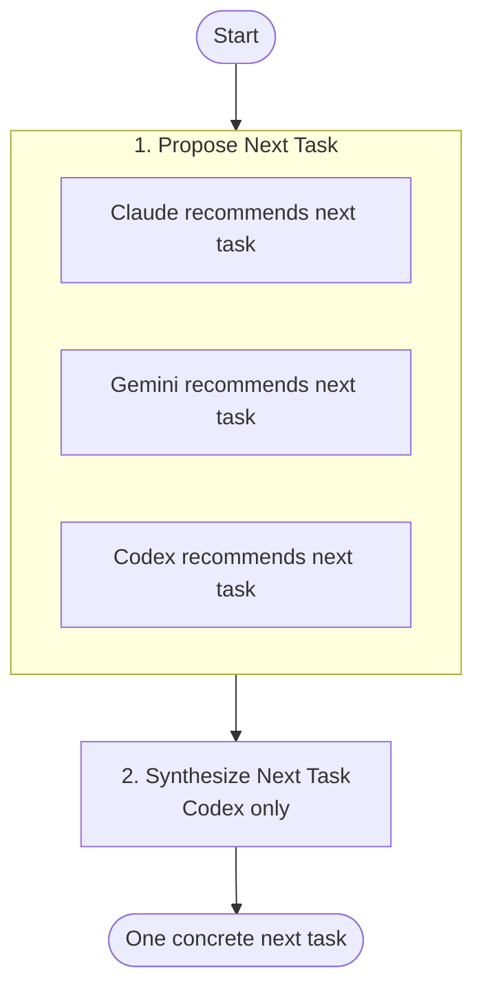

# Do Next Flow

Ask Claude, Gemini, and Codex what to work on next, then synthesize their recommendations into one concrete next task.

Use this when you're staring at a repo and don't know what move actually matters most.

## When to use it

- Picking up a project after time away and wanting an outside opinion.
- Deciding between several plausible next tasks.
- Sanity-checking your own gut call against three independent models.
- Producing a single, actionable recommendation rather than a wishlist.

Not for: brainstorming many ideas (use the `ideas` flow), or executing work that's already scoped.

## Flow



## Steps

| # | Step | Agents | Purpose |
|---|------|--------|---------|
| 1 | `propose` | claude, gemini, codex | Each agent independently studies the repo and recommends the single most logical next development task. |
| 2 | `synthesize` | codex | Single agent reconciles the three recommendations into one concrete next task. |

## Run

```bash
nax do-next
```
