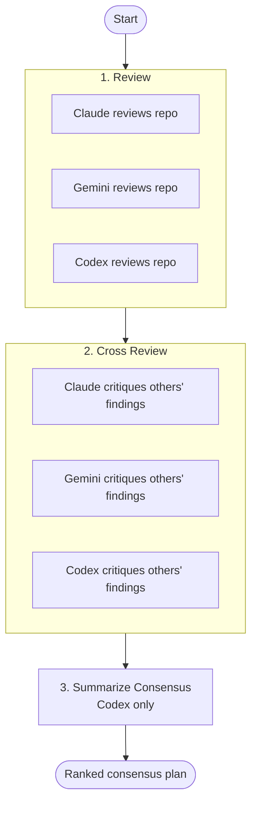

# Review Flow

Three-agent code review with adversarial cross-check: Claude, Gemini, and Codex review the project independently, critique each other's findings, and produce one ranked consensus plan.

Catches things any single reviewer would miss and filters out findings the other models disagree with.

## When to use it

- Pre-release hardening of a project or branch.
- Auditing an unfamiliar codebase before changing it.
- Filtering noisy single-model review output through peer disagreement.
- Producing a ranked, defensible punch list rather than a wall of suggestions.

Not for: targeted single-PR review (use `/review` or `/ultrareview`), or quick lint-style checks.

## Flow



## Steps

| # | Step | Agents | Purpose |
|---|------|--------|---------|
| 1 | `review` | claude, gemini, codex | Each agent independently explores the repo and reports findings and improvements. |
| 2 | `cross-review` | claude, gemini, codex | Each agent cross-checks the other agents' findings, agreeing, disputing, or escalating. |
| 3 | `synthesize` | codex | Single agent merges first-round and cross-review output into one ranked consensus plan. |

## Run

```bash
nax review
```
