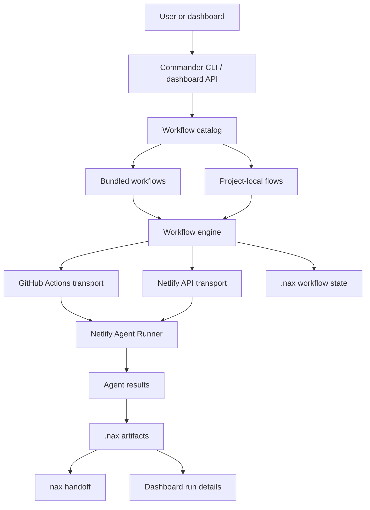

# Architecture

`nax` is a layered CLI around a workflow engine. The command parser stays thin, workflow files describe agent orchestration, transports submit work to Netlify Agent Runner, and local stores preserve enough state to resume, inspect, and hand off the results.

## Big picture

## Components

| Component | Role |
| --- | --- |
| CLI command layer | Parses commands and normalizes options. |
| Workflow catalog | Loads bundled and project-local flows. |
| Workflow engine | Applies model overrides, context, inputs, waits, and state. |
| Transports | Submit work through GitHub Actions or local Netlify API. |
| Prompt delivery | Combines prompts, context, prior results, and blob offload. |
| Artifacts | Persist summaries, events, sessions, runners, and workflow state. |
| Dashboard | Provides local graph, event, run detail, and follow-up UI. |

## Why this shape

The important design choice is that orchestration lives in files, not terminal history. A team can review a `flow.yml`, inspect prompt Markdown, compare artifacts from prior runs, and rerun only the steps they need.

## Non-goals

- `nax` is not a local model runner.
- `nax` is not a general CI system.
- `nax` does not hide transport prerequisites.
- `nax` does not automatically decide that an agent recommendation is correct.

## See also

- [Transports](/concepts/transports) for execution trade-offs.
- [Artifacts](/concepts/artifacts) for saved state and handoff paths.
- [Workflow file reference](/reference/workflow-files) for the schema that drives the engine.
- [Use the dashboard](/guides/use-the-dashboard) for the browser surface.
