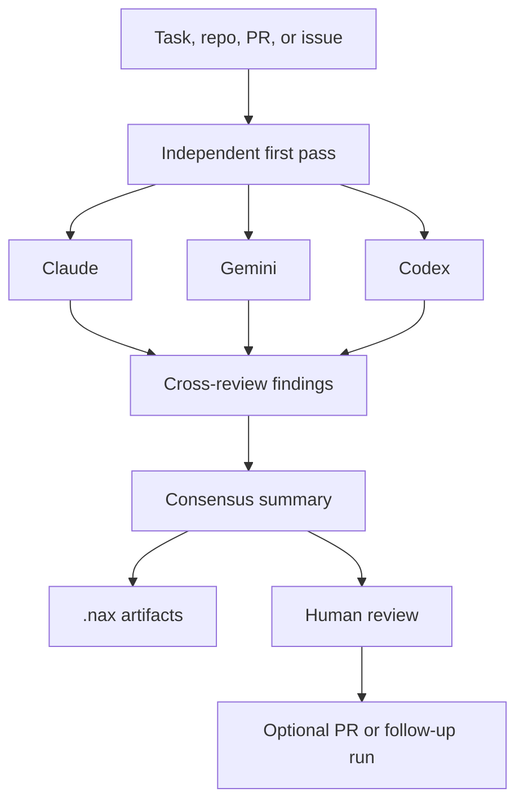

# Council pattern

The core `nax` workflow shape is a council of agents: run selected models independently, pass their findings into a cross-review step, then synthesize only the claims with enough evidence or useful disagreement.

This is not majority voting. The goal is to preserve independent judgment before the models influence each other, then make disagreements inspectable before a person acts on the result.

## Shape



The first pass should ask each agent to inspect the same task without seeing the other answers. Later steps can include earlier results so agents can confirm, reject, duplicate, or challenge specific findings.

## Why it works

- Different models have different strengths and failure modes.
- Agreement is more useful when it happens after independent first passes.
- Disagreement is useful when it includes concrete evidence.
- The final synthesis can filter plausible but unsupported claims.
- Saved artifacts make the run auditable instead of reducing it to one final blob.

## Common workflows

Use the council pattern for work that benefits from structured disagreement before action:

- Code review: inspect a diff, cross-check findings, and summarize the issues a human should review.
- Security review: focus on auth, billing, webhooks, data exposure, dependencies, and deployment configuration.
- Bug triage: classify reports, propose likely causes, rank severity, and recommend diagnostics.
- Feature planning: compare model proposals against docs, user pain, analytics notes, and repo constraints.
- Bake-offs: ask agents for competing implementation plans, then compare complexity, risk, and expected quality.
- PR repair: analyze a failing PR, build a fix plan, then let one agent implement after review.

## Runtime model choice

Model choice is part of the run, not only part of the workflow file:

```sh
nax run review --models claude,codex
nax run review --step-models cross-review=gemini --step-models synthesize=codex
```

Use the full council when a task is high risk or ambiguous. Use a smaller model set for cheap triage, targeted follow-up, or quick checks before spending more tokens.

## Human authority

`nax` can do exploration, synthesis, and first-pass implementation, but the workflow should still make approval explicit when the result can change code or affect production decisions. Use a human review gate or route the final artifact into a PR so a person owns the merge decision.

## See also

- [Write custom workflows](/guides/write-custom-workflows) for flow files and prompts.
- [Artifacts](/concepts/artifacts) for the saved audit trail.
- [Use the dashboard](/guides/use-the-dashboard) for inspecting prompts, outputs, and disagreements.
