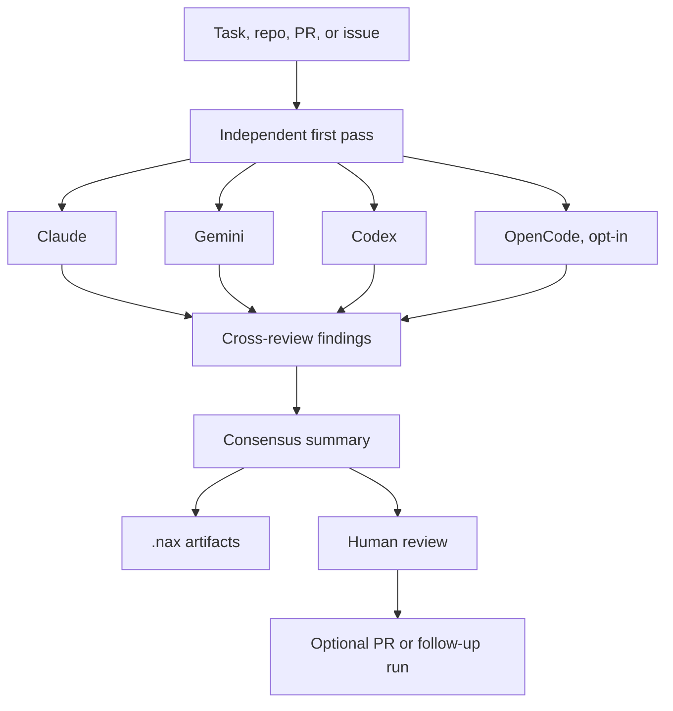

import { CouncilViz } from '../../components/council-viz'

# Council pattern

The core `nax` workflow shape is a council of agents: run selected providers independently, pass their findings into a cross-review step, then synthesize only the claims with enough evidence or useful disagreement.

This is not majority voting. The goal is to preserve independent judgment before the agents influence each other, then make disagreements inspectable before a person acts on the result.

Step through a full council run below — or press play.

<CouncilViz />

## Shape


```mermaid
flowchart TD
  input[Task, repo, PR, or issue]
  fanout[Independent first pass]
  claude[Claude]
  gemini[Gemini]
  codex[Codex]
  opencode[OpenCode, opt-in]
  cross[Cross-review findings]
  consensus[Consensus summary]
  artifacts[.nax artifacts]
  human[Human review]
  followup[Optional PR or follow-up run]

  input --> fanout
  fanout --> claude
  fanout --> gemini
  fanout --> codex
  fanout --> opencode
  claude --> cross
  gemini --> cross
  codex --> cross
  opencode --> cross
  cross --> consensus
  consensus --> artifacts
  consensus --> human
  human --> followup
```

The first pass should ask each agent to inspect the same task without seeing the other answers. Later steps can include earlier results so agents can confirm, reject, duplicate, or challenge specific findings.

## Why it works

- Different models have different strengths and failure modes.
- Agreement is more useful when it happens after independent first passes.
- Disagreement is useful when it includes concrete evidence.
- The final synthesis can filter plausible but unsupported claims.
- Saved artifacts make the run auditable instead of reducing it to one final blob.

## Common workflows

Use the council pattern for work that benefits from structured disagreement before action:

- Code review: inspect a diff, cross-check findings, and summarize the issues a human should review.
- Security review: focus on auth, billing, webhooks, data exposure, dependencies, and deployment configuration.
- Bug triage: classify reports, propose likely causes, rank severity, and recommend diagnostics.
- Feature planning: compare model proposals against docs, user pain, analytics notes, and repo constraints.
- Bake-offs: ask agents for competing implementation plans, then compare complexity, risk, and expected quality.
- PR repair: analyze a failing PR, build a fix plan, then let one agent implement after review.

## Runtime agent and model choice

Provider, model, and effort choice can all be part of the run:

```sh
nax run review \
  --agents claude,codex \
  --models claude=claude-opus-4-8 \
  --efforts claude=high
nax run review --step-agents cross-review=gemini --step-agents synthesize=codex
```

Bundled councils default to Claude, Gemini, and Codex. OpenCode is a selectable fourth member — add it with `--agents claude,gemini,codex,opencode` (or per step) when you want a wider spread of models.

Use the full council when a task is high risk or ambiguous. Use a smaller agent set for cheap triage, targeted follow-up, or quick checks before spending more tokens.

## Human authority

`nax` can do exploration, synthesis, and first-pass implementation, but the workflow should still make approval explicit when the result can change code or affect production decisions. Use a human review gate or route the final artifact into a PR so a person owns the merge decision.

## See also

- [Write custom workflows](/guides/write-custom-workflows) for flow files and prompts.
- [Artifacts](/concepts/artifacts) for the saved audit trail.
- [Use the dashboard](/guides/use-the-dashboard) for inspecting prompts, outputs, and disagreements.
