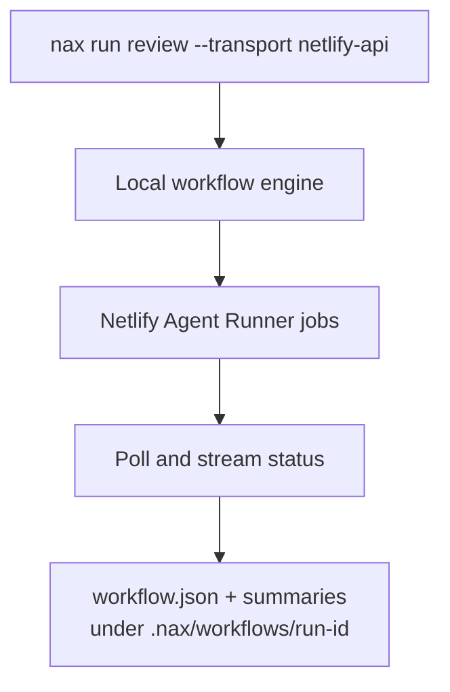
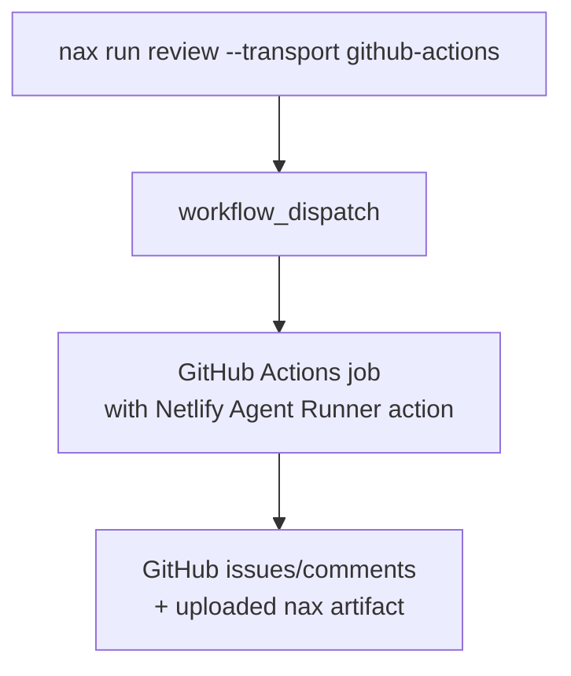

# Transports

`nax` can submit the same workflow through two transports: GitHub Actions or the local Netlify Agent Runner API. Both paths run agents on Netlify, but they differ in where orchestration happens, how state is recovered, and which logs are easiest to inspect.

## Comparison

| Capability | GitHub Actions | Netlify API |
| --- | --- | --- |
| Orchestration location | Hosted GitHub workflow | Current machine |
| Setup | Workflow file plus repo secrets | Logged-in Netlify CLI and linked site |
| Default selection | Preferred by `--transport auto` when available | Used when forced or when Actions is unavailable |
| Logs | GitHub Actions logs and uploaded artifacts | Local terminal, `.nax`, dashboard events |
| Resume after local interruption | Re-run or sync the Actions artifact | Resume unfinished local workflow state |
| Dashboard live events | Limited to local process visibility | Full local structured event stream |
| Best for | Team-visible hosted runs | Interactive local orchestration and follow-up work |

## Local Netlify API flow

Use this path when you want local resume, dashboard event streaming, and tight handoff into your current coding session. Your machine must stay available while orchestration is active, but interrupted runs can be resumed from local state.

## GitHub Actions flow

Use this path when the team wants hosted logs, GitHub-native visibility, and a machine-independent run. Use `nax admin sync` when you need to pull remote artifacts back into the local `.nax` tree.

## Choosing a transport

Start with `--transport auto` unless you need one behavior explicitly.

Use GitHub Actions when the run should be visible to the team, should survive your laptop going offline, or should attach naturally to repository automation.

Use the Netlify API transport when you are driving an interactive investigation, watching the dashboard, or feeding the result directly into another local agent session.

## Common mistakes

- Expecting GitHub Actions runs to have full local live dashboard state. The dashboard is strongest with local Netlify API orchestration.
- Forcing `github-actions` before the repository workflow and required secrets exist.
- Forcing `netlify-api` on a machine that has not logged in to the Netlify CLI or linked a site.

## See also

- [Run workflows](/guides/run-workflows) for transport flags.
- [Artifacts](/concepts/artifacts) for the `.nax` files produced by either transport.
- [Configuration reference](/reference/configuration) for transport-related environment variables.
