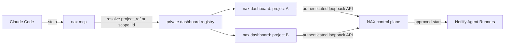

import { Callout, Steps, Tabs } from 'nextra/components'

# Use NAX with Claude

NAX exposes its local dashboard as a Model Context Protocol (MCP) control plane. Claude can discover workflows, prepare an immutable plan, ask you to review it, start remote Netlify Agent Runners, wait for progress, and inspect the resulting artifacts.

<Callout type="info">
  The local MCP control plane ships now. Desktop and hosted control planes use the same runtime-neutral contracts, but are not shipped yet.
</Callout>

## How the local control plane works



`nax mcp` does not own a dashboard or a fixed port. One stdio server routes each call to an explicit project scope through the private per-user dashboard registry. `context_get` accepts a project reference and returns an opaque `scope_id`; later calls preserve that scope without changing process cwd or shared state. This is why one Claude MCP definition can control several projects safely and a dashboard can restart on a different port without changing the MCP configuration.

Closing Claude or its MCP child does not stop dashboards or remote runs. Closing a dashboard removes only that project's registry record; already-submitted Agent Runners continue remotely.

## Prerequisites

- Node.js 20 or newer
- `nax` installed and available on `PATH`
- Claude Code with stdio MCP support
- a project initialized for NAX
- Netlify authentication and an accessible linked Agent Runner site

Run the read-only diagnostic whenever you are unsure:

```sh
nax mcp doctor
```

Doctor checks the executable, package, MCP SDK, Claude configuration, project identity, private registry, dashboard health and authentication, version match, selected Netlify target, capabilities, and one `context_get` call. It never creates a plan or starts a run.

## Configure Claude

<Steps>

### Preview the project-scoped change

```sh
nax mcp setup claude --scope project --dry-run
```

The preview names the exact file and `mcpServers.nax` value before any write.

### Write the configuration

```sh
nax mcp setup claude --scope project
```

Project scope creates or updates `.mcp.json`. Existing MCP servers and unrelated configuration are preserved. When an existing file changes, NAX writes a timestamped backup and replaces the file atomically. Repeating the command does not duplicate the server. For exactly one personal NAX entry shared by every Claude project, use `--scope user` instead.

### Start the project control plane

```sh
nax dashboard --no-open
```

Leave that process running while Claude controls this project. Start `nax dashboard --no-open` in each additional local project Claude should control. Each dashboard chooses an available loopback port and advertises its project privately; do not put paths, ports, or dashboard tokens in Claude configuration.

### Verify the connection

```sh
nax mcp doctor
```

In Claude, ask: “Call `context_get` and tell me the exact project, Netlify site, branch, and available NAX capabilities. Do not start anything.”

</Steps>

## Choose a Claude scope

<Tabs items={['Project', 'Local', 'User']}>
  <Tabs.Tab>

```sh
nax mcp setup claude --scope project
```

Writes `.mcp.json` in the project. Choose this when the team wants a reviewable, checked-in MCP declaration. The generated command contains no machine-specific project path.

  </Tabs.Tab>
  <Tabs.Tab>

```sh
nax mcp setup claude --scope local
```

Writes the project-specific entry in your user Claude state. Choose this when you do not want to commit `.mcp.json`.

  </Tabs.Tab>
  <Tabs.Tab>

```sh
nax mcp setup claude --scope user
```

Writes one reusable user-level NAX entry. This is the simplest configuration for controlling multiple projects from one Claude session.

  </Tabs.Tab>
</Tabs>

The generated server entry is:

```json
{
  "type": "stdio",
  "command": "nax",
  "args": ["mcp"]
}
```

Setup never starts a dashboard. Starting a long-lived process as a configuration side effect would make ownership and cleanup ambiguous.

## Run a workflow safely

The built-in `run_remote_workflow` prompt teaches this sequence, or Claude can call the tools directly.

1. `context_get` resolves the intended project and verifies its immutable scope, selected site, branch, capabilities, and agent catalog.
2. `workflow_list` returns exact workflow IDs.
3. `workflow_get` inspects the chosen workflow and optional graph.
4. `workflow_plan` validates branch and structured agent instances. It does not start paid work.
5. Claude presents the plan's target, steps, expected runner count, expiry, and warnings for your approval.
6. `run_start` receives only the returned `plan_id` and a stable `request_id`. No start-time override is accepted.
7. `run_wait` uses the returned cursor until events, a terminal state, a review gate, a stall, or a timeout.
8. `run_get` with `view: "details"` inspects actual results and artifact links.

Every tool follow-up returned by NAX already contains the resolved `scope_id`. Preserve it. Omitting `scope_id` intentionally falls back to Claude's current project.

## Control another project from the same Claude session

Suppose Claude is open in `revenue-engine`, but the requested work belongs in `gtm-services`. Start that project's dashboard once:

```sh
cd /workspace/gtm-services
nax dashboard --no-open
```

Then Claude calls `context_get` with:

```json
{
  "project_ref": "/workspace/gtm-services"
}
```

That result contains the exact `scope_id` for `gtm-services`. Claude uses it in `workflow_list`, planning, start, wait, and control calls. An exact absolute directory always resolves deterministically. A short name, site name, site ID, repository ID, project ID, or scope ID resolves only against currently advertised dashboards; ambiguous matches fail closed and return exact candidates.

The router never calls `chdir` and never changes a global current project, so concurrent calls for different scopes cannot bleed into each other. A future desktop or hosted runtime can map the same opaque scope to a workspace or account authorization instead of a local directory.

Example planning input:

```json
{
  "scope_id": "scope_01JEXAMPLE",
  "workflow_id": "security-review",
  "branch": "main",
  "instances": [
    {
      "agent": "codex",
      "model": "gpt-5.6-sol",
      "effort": "high"
    }
  ]
}
```

Example start input:

```json
{
  "scope_id": "scope_01JEXAMPLE",
  "plan_id": "plan_01JEXAMPLE",
  "request_id": "request_01JEXAMPLE"
}
```

Reuse the same `request_id` when retrying an ambiguous network response. NAX durably replays the original start instead of creating another paid run. If the intended request changes, create a new plan and request ID.

## Review gates and targeted controls

Claude must read a run before controlling it. NAX returns exact `agent_run_id` and `review_gate_id` values as part of run summaries and details.

- `review_gate_resolve` approves or cancels one exact pending gate.
- `run_cancel` cancels one exact run or one exact active agent run.
- `agent_run_retry` retries one exact terminal agent run with a stable request ID.
- `agent_run_followup` continues from one exact agent result and optional artifacts.

There are no mutable select-project, cancel-all, approve-all, or provider-name broadcast tools. Project selection is explicit on `context_get`, and consequential actions require both the returned scope and concrete entity IDs from scoped discovery.

## Read large results

Tool responses are deliberately bounded. Lists are paginated, events use opaque cursors, run details return an index before full section Markdown, and large artifacts are exposed as `nax://` resources.

Use `run_get` with `view: "details"`, then either request one returned `section_id` or read an exact artifact resource URI. Treat a successful submission as evidence that work started—not evidence that the requested work succeeded.

## Dashboard restarts

If a dashboard exits, the next MCP call returns `dashboard_not_running` with a project-specific recovery command:

```sh
nax dashboard --project-root '/workspace/gtm-services' --no-open
```

After restart, the existing MCP process discovers the new dashboard instance and port on its next call. The project scope remains stable because it is derived from the persisted project identity, not from the process or port.

## Netlify MCP is complementary

The official Netlify MCP and NAX MCP solve different problems. Netlify MCP exposes Netlify platform operations. NAX MCP exposes NAX workflow definitions, immutable run planning, durable run state, event waiting, exact Agent Runner controls, and NAX artifacts. They can be configured together.

## See also

- [MCP tools and resources](/reference/mcp) for the complete surface.
- [Use the dashboard](/guides/use-the-dashboard) for the browser workbench.
- [Troubleshooting](/troubleshooting#mcp-control-plane) for error-specific recovery.
