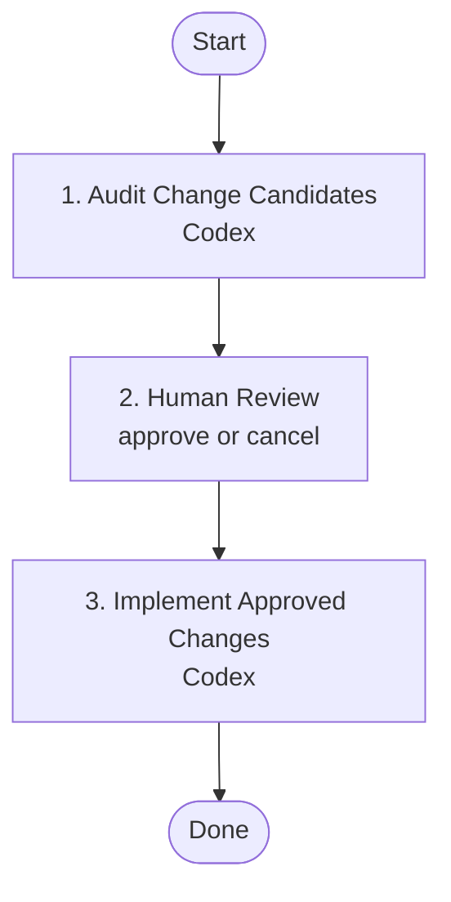

# Human Review Example Flow

Demonstrates a human-in-the-loop workflow: one agent proposes changes, the flow pauses for a person to review the results, and the final step only runs after approval.

Use this as a copy/paste starting point for project-local workflows that need a stop point before implementation, deployment, cleanup, or any other irreversible step.

## Flow



## Steps

| # | Step | Agents | Purpose |
|---|------|--------|---------|
| 1 | `audit` | codex | Produce a reviewable plan without changing files. |
| 2 | `human-review` | none | Pause the run until a person continues or cancels it in the visualizer. |
| 3 | `implement` | codex | Continue the prior runner thread and implement only the approved work. |

## Human Review Step

```yaml
- id: human-review
  title: Human Review
  description: Pause for a person to review the audit and either continue or cancel the flow.
  action: human-review
  input:
    - step: audit
      results: all
```

The workflow runner normalizes this to `submit: human-review` and `waitFor: human-review`, so no prompt or agent list is needed.

## Run

```bash
nax human-review-example
```

Or inspect it in the visualizer:

```bash
nax visualize human-review-example
```
