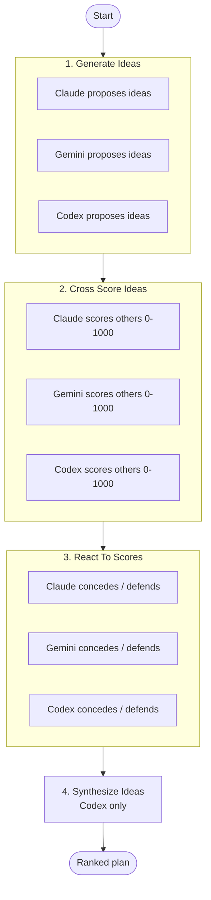

# Ideas Flow

Multi-agent **idea duel**: Claude, Gemini, and Codex independently propose improvements to a project, then adversarially score, react to, and synthesize each other's ideas into one ranked plan.

Disagreement is the signal. The flow rewards concrete, defensible ideas and exposes the ones that collapse under scrutiny.

## When to use it

- Brainstorming high-leverage improvements before a planning cycle.
- Stress-testing your own ideas with three independent critics.
- Surfacing blind spots that any single model would miss.
- Producing a defensible, ranked roadmap rather than a flat list.

Not for: routine bug fixes, well-scoped feature work, or anything where the next move is already obvious.

## Flow



## Steps

| # | Step | Agents | Purpose |
|---|------|--------|---------|
| 1 | `ideate` | claude, gemini, codex | Each agent independently studies the repo and proposes its strongest ideas. |
| 2 | `cross-score` | claude, gemini, codex | Each agent scores the other agents' ideas on a 0-1000 adversarial rubric. |
| 3 | `react` | claude, gemini, codex | Each agent concedes valid criticism, defends strong ideas, and names blind spots. |
| 4 | `synthesize` | codex | Single agent rolls everything into one ranked, categorized plan. |

## Run

```bash
nax run ideas
```
